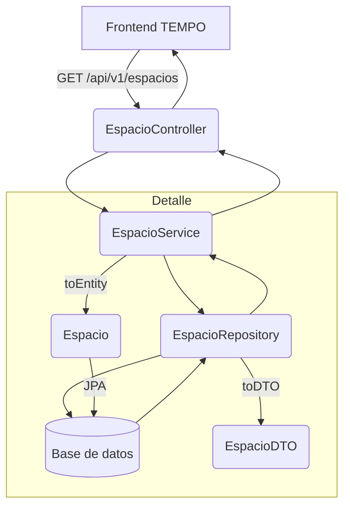
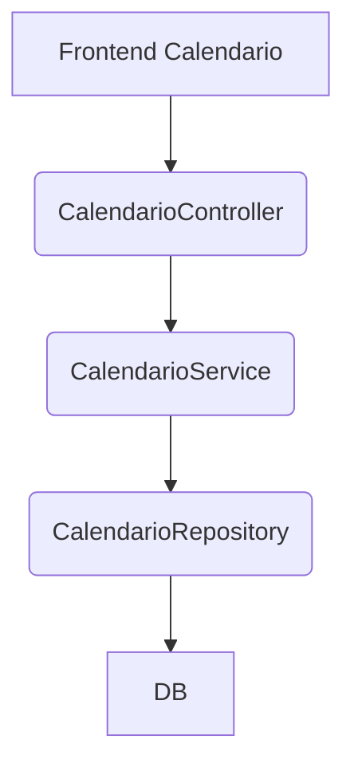

# Guía de réplica backend del módulo TEMPO (Teatro Real — Rama Sandra)

Esta guía describe **todo lo que se debe replicar en la capa backend** para poder reconstruir el módulo TEMPO de manera idéntica. Incluye:
- Estructura actual del backend (controladores, servicios, DTOs, entidades, repositorios).
- Endpoints activos, contratos REST esperados y ejemplos de payload/respuesta.
- Flujos con diagramas (Mermaid) para cada submódulo.
- Recomendaciones de configuración, inicialización de datos y pruebas.
- Plan de implementación para los submódulos Espacios, Calendario, Logística y Cartelería en la rama Sandra (Spring Boot).

> **Nota técnica**: la implementación del backend actual reside en `teatro-real-backend/src/main/java/com/teatroreal`. Se basa en Spring Boot 3+, Lombok, Spring Data JPA y SpringDoc (OpenAPI). La réplica debe mantener la misma arquitectura y contratos para garantizar que el frontend reutilice exactamente los endpoints descritos.

---

## 1. Arquitectura y paquetes clave

```
com.teatroreal
├── controller       # Capas REST (EspacioController, HealthController...) con OpenAPI annotations
├── dto              # Objetos de transferencia (EspacioDTO, ApiResponse...)
├── entity           # Entidades JPA (Espacio)
├── repository       # Repositorios Spring Data (EspacioRepository)
├── service          # Lógica de negocio (EspacioService)
├── config           # Configuraciones (CorsConfig, OpenApiConfig, DataInitializer)
└── TeatroRealApplication.java (main)
```

- Se usa `lombok` para getters/setters/constructores.
- `ApiResponse` uniformiza las respuestas (estructura `{ success, message, data }`).
- `@Transactional` en servicios garantiza consistencia transaccional y en los métodos `readOnly = true`.
- `@PrePersist/@PreUpdate` en entidades para capturar `createdAt`/`updatedAt`.

---

## 2. Contratos fundamentales

### 2.1. Espacios (`/api/v1/espacios`)

| Método | Ruta | Descripción | Códigos REST |
|--------|------|-------------|-------------|
| GET | `/api/v1/espacios` | Lista completa de espacios. | 200 |
| GET | `/api/v1/espacios/activos` | Sólo espacios activos. | 200 |
| GET | `/api/v1/espacios/{id}` | Detalle de un espacio. | 200 + 404 |
| POST | `/api/v1/espacios` | Crear nuevo espacio (activa por defecto). | 201 |
| PUT | `/api/v1/espacios/{id}` | Actualizar campos (nombre, tipo, etc.). | 200 + 404 |
| DELETE | `/api/v1/espacios/{id}` | Eliminar espacio. | 200 + 404 |

Todos devuelven `ApiResponse<T>` (estructura: `success`, `message`, `timestamp`, `data`).

### 2.2. DTOs y payloads

**EspacioDTO**

```json
{
  "id": 1,
  "nombre": "Sala Gayarre",
  "tipo": "Sala de ensayos",
  "descripcion": "Sala climatizada con capacidad 120",
  "capacidad": 120,
  "activo": true,
  "createdAt": "2025-12-01T10:32:00",
  "updatedAt": "2025-12-02T09:15:00"
}
```

- `nombre` y `tipo` obligatorios (`@NotBlank`).
- `activo` puede omitirse (por defecto true).
- Se incluye auditoría `createdAt`/`updatedAt`.

**ApiResponse**

```json
{
  "success": true,
  "message": "Espacio creado correctamente",
  "timestamp": "2026-01-22T14:00:00",
  "data": { ... }
}
```

---

## 3. Flujo completo: Front -> Controlador -> Servicio -> Repositorio -> DB



- El frontend consume el endpoint y recibe un `ApiResponse` con lista o detalle.
- El controlador delega a `EspacioService`, que administra conversiones `entity <-> DTO`.
- El repositorio usa Spring Data JPA y expone métodos `findAll`, `findByActivoTrue`, `findByTipo`, `findByNombreContainingIgnoreCase`.

---

## 4. Configuraciones clave

### 4.1. `CorsConfig`
Permite llamadas desde el frontend (dominios permitidos). Replica este bean con `@Bean` `CorsConfigurationSource`.

### 4.2. `OpenApiConfig`
Define título del API, descripción y versionado. Documenta los endpoints y permite que Swagger UI los muestre (`/swagger-ui/index.html`).

### 4.3. `DataInitializer`
Carga espacios iniciales (Escenario Principal, etc.) para tests manuales. Replica la lógica: `@PostConstruct` crea entidades simuladas si la tabla está vacía.

---

## 5. Recomendaciones de diseño para la réplica

- Mantener `EspacioDTO` tal cual para facilitar validaciones y consumos.
- Hacer que todos los endpoints usen la estructura `ApiResponse`.
- Aplicar `@RequiredArgsConstructor` en `@RestController` y `@Service`.
- Usar `@Transactional(readOnly = true)` para lecturas y plain `@Transactional` para escrituras.
- Documentar cada endpoint con `@Operation` / `@Parameter` (SpringDoc) para que Swagger se mantenga.

---

## 6. Plan específico por submódulo

### 6.1. Espacios
Ya existe – replicar exactamente como se describió arriba. Garantizar:
- Entidad `Espacio` con campos mencionados y `@PrePersist/@PreUpdate`.
- Servicio con métodos `findAll`, `findAllActivos`, `findById`, `create`, `update`, `delete`.
- Repositorio con filtros `findByTipo`, `findByNombreContainingIgnoreCase`.
- Controller con mapeos CRUD y `ApiResponse`.
- Diagramas: ya descrito en el flujo.

### 6.2. Calendario (pendiente en backend actual)
Se propone replicar:

#### DTO
```java
@Data
@Builder
public class CalendarioEventDto {
  private Long id;
  private String titulo;
  private LocalDateTime inicio;
  private LocalDateTime fin;
  private String espacio;
  private String tipo;
}
```

#### Endpoints
- `GET /api/v1/calendario/actividades`
- `GET /api/v1/calendario/actividades/{id}`
- `POST /api/v1/calendario/actividades`
- (Opcional) `/api/v1/calendario/filters?espacio=...&tipo=...`

#### Diagrama


### 6.3. Logística
Modelar operaciones logísticas:

#### DTOs
- `LogisticaStatDto { cargasPendientes, completadasHoy, enTransito }`
- `OperacionLogisticaDto { id, descripcion, produccion, fecha, estado, estadoColor, icon, color }`

#### Endpoints
- `GET /api/v1/logistica/summary`
- `GET /api/v1/logistica/operaciones`
- `POST /api/v1/logistica/operaciones` (crear registro)

### 6.4. Cartelería

#### DTO
`PantallaCarteleriaDto { nombre, ubicacion, activa }`

#### Endpoints
- `GET /api/v1/carteleria/pantallas`
- `POST /api/v1/carteleria/pantallas/{id}/publish` (cambia estado de publicación)
- `POST /api/v1/carteleria/pantallas/{id}/preview`

---

## 7. Base de datos y entidades adicionales (plan)

| Entidad | Campos mínimos | Índices sugeridos |
|---------|----------------|-------------------|
| Espacio | id, nombre, tipo, descripcion, capacidad, activo, createdAt, updatedAt | Índice sobre `activo`, `tipo`. |
| EventoCalendario | id, titulo, inicio, fin, espacio_id, tipo, estado | FK hacia `espacios`. |
| OperacionLogistica | id, descripcion, produccion, fecha, espacio_id, estado | Campos de auditoría y `estado`. |
| PantallaCarteleria | id, nombre, ubicacion, activa | Estado booleano. |

---

## 8. Checklist de réplica backend

- [ ] Crear DTOs y entidades para todos los módulos (Espacios, Calendario, Logística, Cartelería).
- [ ] Implementar servicios con métodos CRUD y conversiones entity <-> DTO.
- [ ] Exponer controladores con `ApiResponse` y anotaciones OpenAPI.
- [ ] Configurar CORS/OpenAPI/DataInitializer igual que la rama actual.
- [ ] Documentar endpoints con ejemplos de request/response en Swagger.
- [ ] Dibujar diagramas de flujo (Mermaid) por cada submódulo.
- [ ] Sincronizar contratos con el frontend (nombres de rutas, estructuras JSON, errores).
- [ ] Incluir scripts o data inicial para tests manuales (exportar `DataInitializer`).

---

Con este documento (front + backend) tendrás toda la cartografía necesaria para replicar el módulo TEMPO completo: interfaz, servicios Angular, endpoints Java/Spring Boot, estructura de datos, configuraciones y flujo del sistema. ¿Te gustaría que añadiera también una sección final con tareas concretas por sprint para llevarlo de la guía a la implementación?
